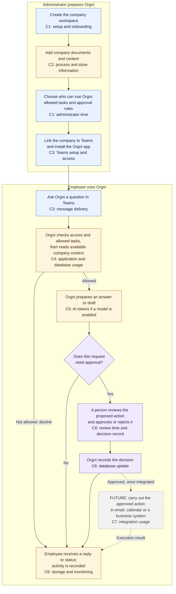

Orgni: user journey and where costs arise

Reviewed against the repository on 1 October 2026. Companion to the [baseline cost inventory](ORGNI_TEAMS_COST_INVENTORY.md); this map does not select an architecture or a cost-reduction target.

Orgni's purpose is to help employees use company information to answer questions, find information and prepare work from Microsoft Teams. Administrators decide who can use it and which activities require approval. Carrying out approved work in external systems is part of the intended product, with integrations still to be completed.

Read the diagram from top to bottom. C0-C7 identify cost points in the table below. The main flow describes the workflow represented in the code when configured, not a verified live deployment. Dashed arrows mark the future external-action step. Adding documents can also happen later, whenever information changes.

**C0 runs alongside the whole journey:** keeping the application available and retaining its information can cost money even when nobody asks a question. Depending on the deployment, this includes paid licenses, provisioned hosting/database capacity, retained storage and backups, domains, registry, monitoring, security and support. Some usage-based compute can scale to zero; subscriptions and retained data do not automatically disappear with it. [Container Apps billing](https://learn.microsoft.com/en-us/azure/container-apps/billing).

| Cost point | When cost is incurred | What creates the cost | Teams-specific or shared? |
|---|---|---|---|
| **C0 — Keep Orgni available** | Recurring commitments, retained data and any provisioned resources, including between conversations. | Hosting, database capacity, storage/backups, existing licenses, domains, CI/registry, selected security/monitoring and support. | Mostly shared. Allocate existing Teams seats here if appropriate. |
| **C1 — Set up the company** | Initial platform work, onboarding each customer, and later configuration changes. | Engineering and administrator time; workspace/member records; optional invitation emails. | Mostly shared; Teams registration work belongs to C3. |
| **C2 — Add or refresh knowledge** | Each new/changed document or processing job; scheduled sync only after implemented. | Upload/processing compute, database writes, storage, and any paid OCR/model/indexing services actually used. This is separate from the cost of asking a question. | Shared; the same information can serve web and Teams users. |
| **C3 — Connect and communicate through Teams** | Registration/installation work; licensed access over time; inbound and outbound messages during use. | Setup effort and existing or additional Teams licenses. Azure Bot standard-channel message transport can be $0; the backend still uses resources. | Teams-specific. Count existing seats only once across C0 and C3. |
| **C4 — Check the request and load context** | For each received request, even if some requests are declined. | Application compute, identity lookups, capability checks, database reads and networking. An early decline avoids the model-generation step. | Shared services, with this request attributable to Teams. |
| **C5 — Prepare the response** | Each actual paid model call. | Input tokens, including instructions/context, plus output/thinking tokens. Without a model key, the template provider makes no model API call. Follow-up questions can cause additional calls. | Shared AI provider; attribute each call to its originating channel. |
| **C6 — Review, reply and keep a record** | On replies, approval decisions and subsequent retention. | Human review time; database writes; audit/log storage and retention. The current approval callback updates state without another model-generation call. | Shared storage and operations; Teams delivery belongs to C3. |
| **C7 — Perform an external action** | Only when a real external integration is implemented and invoked. | Integration hosting/API usage, any required connector or business-system license, and operational support. A license may be recurring rather than a charge per action. | Shared workflow capability; currently a future execution step. |

These labels show where services are used, not eight separate subscriptions. Attribute incremental usage to the relevant step, then count each shared service's monthly invoice once. Provider billing can happen later than the activity that incurred the usage. Microsoft lists Teams as a standard Azure Bot channel with unlimited standard-channel messages on the Free tier; that does not make hosting or AI generation free. [Azure Bot pricing](https://azure.microsoft.com/en-us/pricing/details/bot-services/).

For example, an employee asks, “@Orgni prepare a brief for tomorrow's meeting.” The documents may have been processed earlier at C2. The question then uses C3 message delivery, C4 checks/context, C5 response generation if AI is enabled, and C6 reply/history. A follow-up question repeats the request path; it does not inherently require uploading and processing all documents again. Current context gathering is limited to a small workspace summary, so a comprehensive document-grounded brief remains a product capability to validate and improve.

For a request that needs approval, C5 happens **before** the review in the current engine. Rejecting the action does not undo model usage already incurred. Approval itself currently changes the saved action status; it does not send an email, book a meeting or update a CRM. Those future execution costs belong to C7. There is no background model call solely because an approval is waiting in this flow.

Implementation limits that affect how this journey should be interpreted:

- Production sign-in and secure customer-tenant linking still need work. The Teams bot code exists, but registration, installation and a live end-to-end test are required.
- The onboarding screens follow Organisation → Connect → Context → Capabilities → Approvals → Teams → Ready. The general Microsoft 365 connection is currently a demo; installing the Teams bot does not automatically synchronize SharePoint, OneDrive, email or calendars.
- Document upload/processing has an implementation with service dependencies. The answer engine currently reads counts of sources/fact sets and a recent filename; it is not yet a full content-search/retrieval pipeline.
- Approval cards and decision recording exist. The code's “completed” action label is not proof that work happened in an external system. The diagram separates that future step explicitly.
- Cost attribution is conditional on the actual configuration. No live bill, token totals or production deployment was inspected for this diagram.

Repository evidence: [onboarding](artifacts/orgni/src/pages/app/onboarding.tsx), [Teams request handling](artifacts/api-server/src/teams/bot.ts), [request and approval engine](artifacts/api-server/src/product/engine.ts), [AI provider](artifacts/api-server/src/product/intelligence-anthropic.ts), [document processing route](artifacts/api-server/src/routes/documents.ts), and [production readiness](PRODUCTION.md).

The next cost-reduction matrix can use these C0-C7 identifiers. Attach actual monthly amounts and usage to each point first, then compare savings, Engineering effort and risk while preserving the user outcome at that step.

## Cost-reduction matrix (working draft)

Use this as the next decision frame after the cost map. The aim is not to cut the product in half; it is to trim avoidable spend while preserving the user outcome at each step of the journey.

| Cost point | Best reduction lever | Why it matters in the current product | Expected savings | Engineering effort | Risk | Outcome preserved |
|---|---|---|---|---|---|---|
| **C0 — Keep Orgni available** | Right-size always-on services and separate provisioned capacity from bursty workloads | The app and database remain available between conversations, regardless of whether anyone asks a question | High for running costs, especially DB/hosting/storage | Medium | Low | Core service remains available for Teams and admin work |
| **C1 — Set up the company** | Standardize tenant setup and reuse admin defaults instead of bespoke onboarding | Current product flow is Organisation → Connect → Context → Capabilities → Approvals → Teams → Ready; setup effort is mostly one-time and repeatable | Medium | Low | Low | New tenants still onboard consistently |
| **C2 — Add or refresh knowledge** | Make document processing incremental and deduplicated; only re-index changed files | The implementation stores source counts and facts, but not a full retrieval pipeline yet; processing is not the same as answering a question | High if ingestion is bursty or model-heavy | Medium | Medium | Company context still stays fresh without wasteful reprocessing |
| **C3 — Connect and communicate through Teams** | Reuse existing Teams and Azure licenses; avoid creating needless extra messaging or bot features | Teams setup is a channel cost point, not a model cost point; standard-channel message transport can be free while backend compute remains | Medium | Low | Low | Users still reach Orgni in Teams |
| **C4 — Check the request and load context** | Fail fast on capability and permission checks before expensive downstream work | This is the cheapest place to decline unsupported requests; the engine evaluates capability before model generation | Medium | Low | Low | Invalid or blocked requests are declined early |
| **C5 — Prepare the response** | Gate model usage behind a real need, prefer the template provider by default, and disable paid providers when not configured | The engine has a deterministic provider and an Anthropic-backed provider; model calls are the clearest volume-based cost driver | Very high | Low to medium | Low | Answers still work without an AI provider, but with less generative richness |
| **C6 — Review, reply and keep a record** | Keep audit data lean, shorten retention for low-value records, and avoid extra follow-up writes | Approval and reply state are logged in the database; the current flow records activity without additional model work | Medium | Low | Low | Review and traceability remain intact |
| **C7 — Perform an external action** | Defer integration work until a business case is proven; keep the external-action step behind approval and explicit execution | This is a future step only; no actual action execution is currently confirmed in the code | Very high if not implemented | High | Medium | External execution remains available when needed |

### Recommended priority order

1. **C5 — model usage and provider routing**: This is the biggest cost lever on a per-request basis and the easiest one to control without changing business outcomes.
2. **C0 — always-on hosting and retained data**: This is the biggest monthly fixed cost if the environment is overprovisioned.
3. **C2 — document ingestion**: Best savings come from processing only what changed and avoiding duplicate indexing work.
4. **C4 — early decline path**: A low-effort reduction with immediately measurable benefit, because blocked requests avoid model spend.
5. **C7 — future external actions**: Keep it deferred; do not pay for integrations until they are required by a real user workflow.

### Rule of thumb for a real cost baseline

The right comparison is not “which point is most expensive in theory?” but “which point has the largest avoidable spend per user outcome.” For Orgni, the answer is usually:

- More capability toggles and approval rules reduce unnecessary model and integration spend.
- Better context hygiene reduces unnecessary document-processing cost.
- The template provider lowers C5 spend while still supporting the current request flow.
- Delay C7 until the system is operational and the business value is proven.

### Suggested decision template

For each cost point, capture:

- Monthly spend: actual invoice or resource estimate
- Usage driver: input tokens, database reads, message volume, storage growth, or human review time
- Savings potential: can be reduced without losing the user outcome
- Engineering effort: low, medium or high
- Operational risk: business impact if the reduction fails

Then compare each option using this score:

Savings / effort / risk, while keeping the user outcome at the same step.

This protects the product from a common mistake: reducing the cost of the whole journey by accidentally removing the capability that created the business value in the first place.

### What this means for Orgni today

The current repository suggests a product that is already structured to avoid the most expensive path in a disciplined way:

- payment or external write actions are gated behind approval policies
- capabilities are toggled per organisation
- the default model path can be non-generative when no provider is configured
- teams interaction is real, but the external execution step is still intentionally separate

That makes the strongest cost-reduction opportunities relatively clear and low-risk: keep the system available, make the model optional, and postpone expensive execution until it is actually required.
