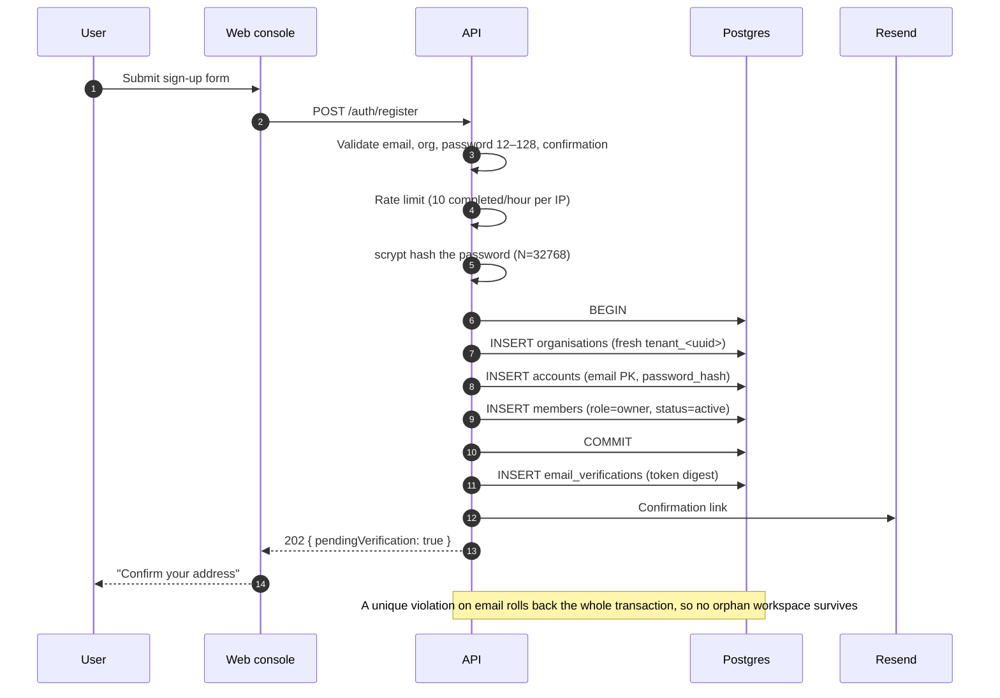
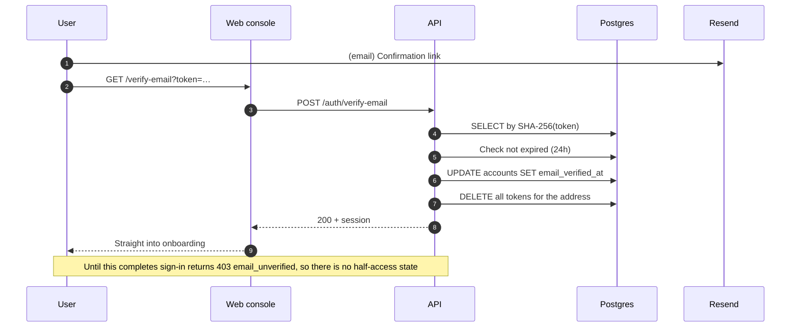
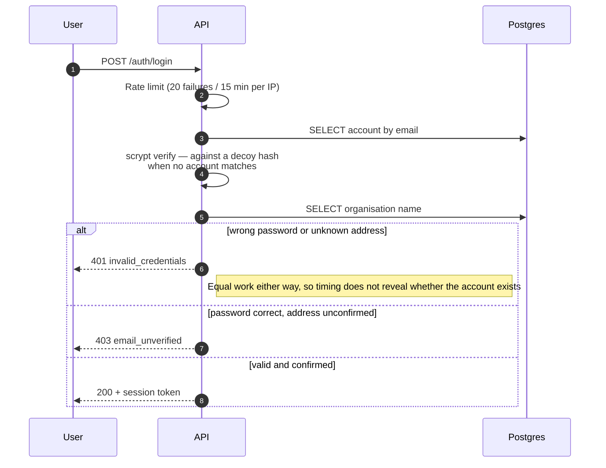
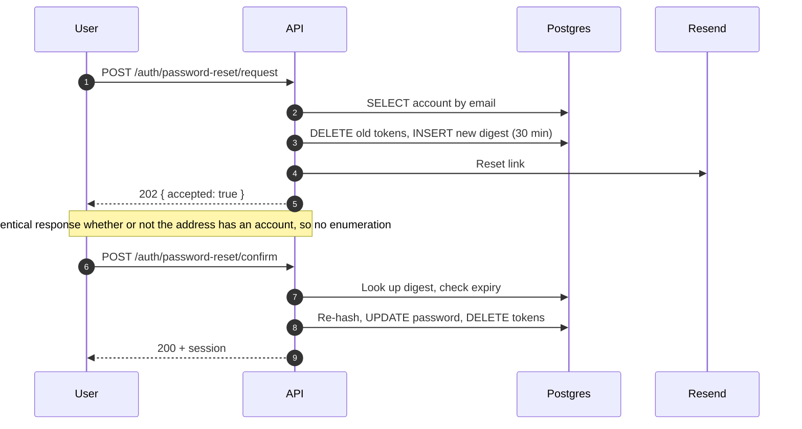
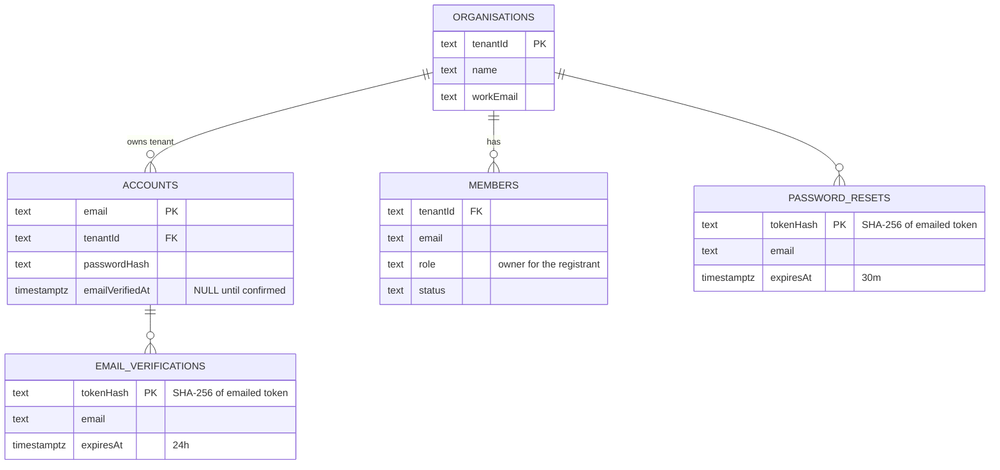
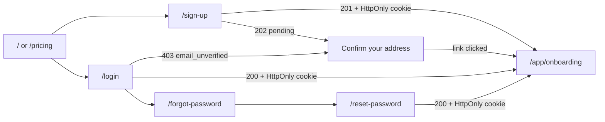
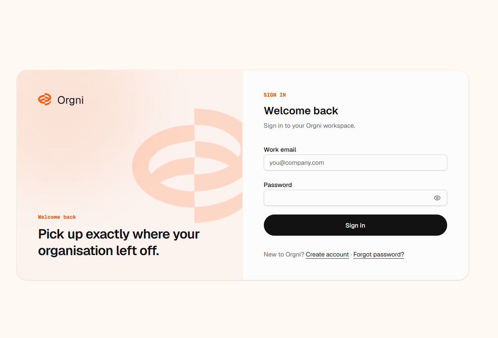
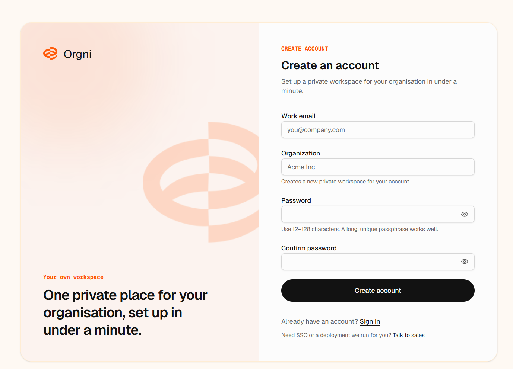
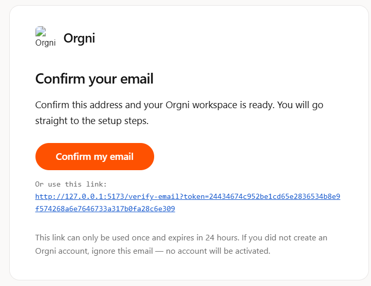
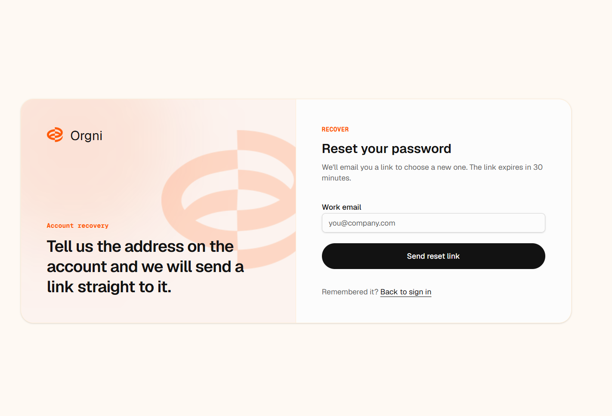

# Orgni - Authentication

Credential authentication for Orgni: registration, sign-in, password recovery
and email verification.

This documents the auth system built on the `login-feature` branch, including
the design decisions and the reasoning behind them. For deployment
requirements see [PRODUCTION.md](PRODUCTION.md).

---

## What it does

A new user can create an account, confirm their email address, land in
onboarding, and sign in with the credentials they chose. Nothing is stored in
plain text, no unverified address receives a session, and the credential
endpoints are rate limited per client.

### Endpoints

All under `/api`, all session-free except `GET /auth/me`.

| Method | Path | Purpose | Success |
|---|---|---|---|
| `POST` | `/auth/register` | Create account + tenant + first Owner | `201` + session, or `202` if confirmation is pending |
| `POST` | `/auth/verify-email` | Spend a confirmation token | `200` + session |
| `POST` | `/auth/verify-email/resend` | Re-send a confirmation link | `202` (always, even for unknown addresses) |
| `POST` | `/auth/login` | Exchange credentials for a session | `200` + session |
| `POST` | `/auth/password-reset/request` | Email a reset link | `202` (always) |
| `POST` | `/auth/password-reset/confirm` | Spend a reset token | `200` + session |
| `GET` | `/auth/me` | Identify the current session | `200` principal |
| `POST` | `/auth/logout` | Expire the browser session cookie | `204` |

---

## Flows

### Registration



The account, its tenant and its first Owner are created in **one transaction**.
A duplicate email rolls all three back — without this, a failed registration
would leave an unreachable organisation behind.

### Email verification



Why this exists: without it, anyone could register `ceo@yourcompany.com`, hold a
working workspace under that identity, and permanently block the real owner
from registering. Worse, `POST /api/product/members` sends invite email to
arbitrary addresses, so an unverified account was effectively an email-sending
tool using Orgni's domain.

### Sign-in



A successful sign-in **clears** the failure budget. Counting successes too
would throttle an entire office sharing one NAT egress for signing in correctly.

### Password recovery



---

## Data model



Each registration mints a **fresh `tenant_<uuid>`**, so two people who pick the
same organisation name never share data.

### Migrations

| | |
|---|---|
| `0005_certain_warbound.sql` | `accounts` table |
| `0006_tricky_human_torch.sql` | `password_resets` |
| `0007_curious_living_mummy.sql` | `email_verifications`, `accounts.email_verified_at` |

`0007` also **backfills** `email_verified_at = created_at` for existing
accounts. Without that, every current account is locked out the moment
verification is switched on.

---

## Security decisions

| Decision | Why |
|---|---|
| scrypt, N=32768, 16-byte per-account salt | Memory-hard; never stored or logged in the clear |
| Decoy hash on unknown addresses | Equalises response time so sign-in cannot enumerate users |
| Only the SHA-256 of emailed tokens is stored | A database dump cannot be replayed against reset or verify |
| Tokens are single-use and deletable | Requesting a new one voids the previous link |
| No session before email confirmation | Removes squatting and the invite-email abuse vector entirely |
| Rate limit counts failures, not requests | Honest users on shared NAT are never punished |
| `Retry-After` on 429 | Tells the client when to come back |

### Rate limiting

| Policy | Limit | Charges on |
|---|---|---|
| Credentials (login, verify, reset confirm) | 20 / 15 min | failures; cleared on success |
| Sign-up | 10 / hour | completed registrations |
| Recovery (reset and verify resend) | 10 / hour | every attempt |

Mistyped sign-up forms are never charged — only a completed registration is.
Counters are per process, so behind multiple replicas add a shared gateway
limit too.

### Environment

| Variable | Required | Purpose |
|---|---|---|
| `DATABASE_URL` | yes | Without it, register and login return `503` |
| `SESSION_SECRET` | in production | ≥32 characters; HMAC key for session tokens |
| `RESEND_API_KEY` + `EMAIL_FROM` | for verification | See below |
| `APP_BASE_URL` | for links | Builds confirmation and reset links |
| `TRUST_PROXY_HOPS` | recommended | Hop count for `req.ip`; wrong value throttles everyone together |

**Email is a hard dependency of signup.** When `RESEND_API_KEY` and `EMAIL_FROM`
are both set, verification is enforced. When they are not, verification is
skipped and the account is stamped verified so local and preview keep working —
but production logs an error, because that is a launch blocker rather than a
silent downgrade.

---

## Web console

Four screens share one frame, so recovery cannot drift from sign-in.

| Route | Purpose |
|---|---|
| `/sign-up` | Create an account |
| `/login` | Sign in |
| `/forgot-password` | Request a reset link |
| `/reset-password?token=…` | Choose a new password |
| `/verify-email?token=…` | Confirm the address |



Design notes:

- Shared `AuthCard` renders the split card — an orange-tinted brand panel with
  the Orgni mark, beside the form. Below `lg` the panel hides and the logo lock
  moves above the form.
- Each screen passes **distinct** panel copy, so recovery does not read like
  sign-up.
- Submit is the marketing CTA shape: pill, near-black, orange on hover. The
  arrow glyph is omitted — it marks navigation elsewhere on the site, and these
  perform actions.
- Password fields have a reveal toggle. Each names its own field
  (`Show password` vs `Show confirm password`) so the two on sign-up are not
  identical to a screen reader.
- Errors render with `role="alert"`; submitting disables the `fieldset`.

### Screenshots

The authentication experience uses one consistent visual system across account
creation, sign-in, verification, and recovery. The captures below document the
current web console. They use fictional data and contain no passwords, API
keys, session tokens, or real email addresses.

#### Sign in

Users with a verified account exchange their credentials for a session at
`/api/auth/login`.



#### Create an account

Registration creates a private organisation workspace and its first Owner.
When email delivery is configured, registration returns a pending state rather
than granting access to onboarding.



#### Confirm the email address

The confirmation message contains a single-use link that expires after 24
hours. Following it verifies the address and creates the session used to enter
onboarding.


#### Recover an account

The recovery screen accepts the account email and sends a time-limited reset
link without revealing whether an address is registered.



> **Documentation note:** Add screenshots for the post-registration
> “Confirm your address” state, the new-password form, the successful
> verification result, and the first onboarding screen as those states are
> captured. Keep them in `screenshots/` and follow the existing naming pattern:
> `verification-pending.png`, `reset-password.png`, `email-verified.png`, and
> `onboarding.png`.

---

## Email

| Template | Sent when |
|---|---|
| `sendVerificationEmail` | Registration, to confirm the address |
| `sendPasswordReset` | A reset is requested for an existing account |
| `sendMemberInvite` | Someone is added to a workspace |

Every message carries a **plain-text alternative**. The reset and confirmation
links exist inside the HTML body only, so without it the link is invisible in
text-only clients and to screen readers.

Layout lives in `lib/email-layout.ts`: a full document (Outlook does not repair
fragments), a table button Outlook will not mangle, the raw URL printed
underneath as a fallback, a preheader, and the mark **embedded as a data URI**.

Two things that are deliberate rather than incidental:

- **Dark mode is opted out** via `color-scheme: light`. iOS Mail and Outlook
  otherwise invert near-black text on a white card into white-on-white. Real
  dark styles are the better fix and are not shipped yet.
- **The logo is embedded, not linked.** Mail clients fetch remote images from
  their own infrastructure, so a linked logo breaks whenever the URL is not
  publicly reachable over HTTPS — always true in development, and not
  guaranteed in production where the API image carries no web assets.

---

## Tests

```
pnpm --filter @workspace/api-server test          # unit, hermetic
pnpm --filter @workspace/api-server test:postgres # against real Postgres
```

| File | Covers |
|---|---|
| `registration.test.ts` | Validation, duplicates, rollback, sessions, throttling, recovery, verification |
| `auth-postgres.test.ts` | Real constraints: SQLSTATE 23505, FK and NOT NULL, transaction rollback, real expiry |
| `email.test.ts` | Layout, plain-text part, digest-only tokens, expiry wording, subject sanitisation |

The Postgres suite is opt-in via `TEST_DATABASE_URL` so the default run stays
hermetic. **Do not set `DATABASE_URL` for the rest of the suite** — the Teams
identity store reads it too and will hit the live database.

---

## Known gaps

- **Email verification is covered in both suites.** The unit suite exercises
  validation and edge cases; the opt-in Postgres suite verifies the real token
  digest, expiry column, account update, and single-use deletion.
- **Browser sessions use an `HttpOnly` cookie.** The web console no longer
  persists session bearer tokens in `localStorage`. The API still accepts
  `Authorization: Bearer` for service clients and API keys; browser requests
  authenticate through the `SameSite=Lax` session cookie.
- **No social or SSO sign-in.** Self-service only. The pricing page advertises
  SSO/SAML for Enterprise, which is a sales conversation, not a self-service
  path.
- **Rate-limit counters are per process.** Fine for one replica; not across
  several.
